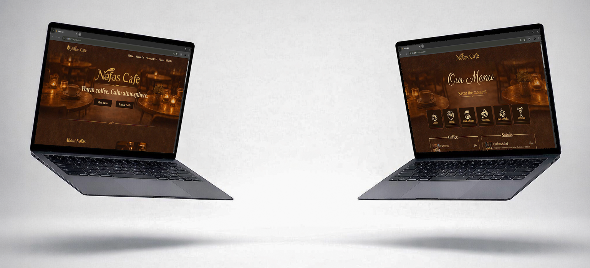

# Nəfəs Cafe

**First commercial project — full cycle: idea → design → frontend**

## About the Project
- Brand concept and naming
- Visual identity and menu design
- Mockups and graphics
- Responsive and interactive website

## Tech Stack
- HTML / CSS / JS
- Figma, Photoshop, Illustrator
- Git / GitHub

## Project Goal
Create a real commercial cafe website from scratch, including branding, design, and development.
